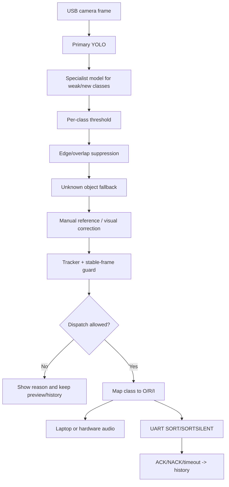

# Model, dataset archive, and training deep dive

Trash Sorter Pro uses a local-first YOLO pipeline. Production runtime is small
and reproducible; large datasets and training caches are kept outside normal
runtime images.

## Production runtime models

Only two model files are treated as production runtime artifacts:

| File | Role | SHA-256 |
| --- | --- | --- |
| `models/best.pt` | Primary YOLO detector | `5453BE15AFCF94732906D72031B2F94B3307B4CE749546906E2FA857BE9B11E5` |
| `models/new-class-specialist.pt` | Specialist detector for weak/new classes such as Pen, Battery, Toothbrush | `8FD59B6CF94E79B74112C3071DEBC794D52CF3EA37695563401D93939AA593BE` |

Verify locally:

```powershell
Get-FileHash models/best.pt,models/new-class-specialist.pt -Algorithm SHA256
```

Other `.pt` files in `models/` are candidates, backups, or optional local
experiments. Do not treat them as production unless the model promotion checklist
has been completed.

## Docker Hub artifacts

Runtime and archive images are separated:

| Image | Purpose |
| --- | --- |
| `nguyenson1710/trash-sorter-web:<git-sha>` | Next.js standalone web dashboard. |
| `nguyenson1710/trash-sorter-agent:<git-sha>` | FastAPI/headless YOLO runtime and Supabase bridge command base. |
| `nguyenson1710/trash-sorter-models:<git-sha>` | Production model archive. |
| `nguyenson1710/trash-sorter-desktop-exe:<git-sha>` | Windows EXE artifact bundle, not a GUI container. |
| `nguyenson1710/trash-sorter-dataset-archive:<git-sha>` | Index image for the split dataset archive. |
| `nguyenson1710/trash-sorter-dataset-archive:<git-sha>-partNN` | Split dataset/cache archive layers. |

The 2026-06-30 verified release is documented in
[`releases/container-dataset-release-99369b06a697.md`](releases/container-dataset-release-99369b06a697.md).

## Dataset archive restore

The local `dataset_v2/` folder can be large and was intentionally archived to
Docker Hub separately from runtime images.

Recommended restore pattern:

1. Pull the dataset index and required part images from Docker Hub.
2. Extract each `/archive/*.zip` or archive payload to a temporary restore
   folder.
3. Verify every part checksum against the release manifest.
4. Reconstruct `dataset_v2/` only when retraining or auditing.
5. Keep restored data outside git and delete it again after training if disk is
   tight.

Do not bake the full dataset into the production web or agent runtime images.
Runtime images should remain small and quick to deploy.

## Data sources

Main local data sources:

| Source | Purpose |
| --- | --- |
| `dataset_v2/low_conf_queue` | Real camera low-confidence queue for manual review. |
| camera anchor/recovery exports | Weak-class recovery and camera-domain anchors. |
| Kaggle/real-image imports | Extra domain coverage when reviewed. |
| `history.db` captures | Field evidence for disputed labels. |
| manual imports | Curated images from phone/camera sessions. |

Quality rules:

- Train only trusted/reviewed labels.
- Keep generated or augmented data marked as generated.
- Lock train/valid/test split by image group to avoid leakage.
- Reject invalid boxes and unknown class ids during export.
- Track route balance across O/R/I bins, not only class count.

## Export YOLO trainset

```powershell
python -m uv run python scripts/export_yolo_trainset.py `
  --queue dataset_v2/low_conf_queue `
  --out dataset_v2/yolo_trainset `
  --model models/best.pt
```

The exporter writes:

- `images/train`, `images/valid`, `images/test`;
- matching YOLO label folders;
- `data.yaml`;
- `export_report.json` with skipped/untrusted/invalid stats.

The exporter canonicalizes class names through the project training class order,
filters untrusted data, and preserves split groups.

## Train a candidate

```powershell
python -m uv run python scripts/train_yolo.py `
  --data dataset_v2/yolo_trainset/data.yaml `
  --model models/best.pt `
  --epochs 100 `
  --imgsz 640 `
  --batch -1 `
  --device 0 `
  --workers 0 `
  --name trash-sorter-candidate-YYYYMMDD
```

Useful flags:

| Flag | Why it matters |
| --- | --- |
| `--workers 0` | Safest on Windows/Ultralytics local laptop runs. |
| `--cache-mode none/ram/disk` | Disk cache can help on limited GPU RAM; none is safest. |
| `--fraction` | Smoke-test a pipeline before long training. |
| `--serial-label-cache` | Helps when Windows blocks Ultralytics worker pipes. |
| `--freeze` | Fine-tune while freezing early model layers. |
| `--lr0`, `--lrf`, `--warmup-epochs` | Reproducible optimizer schedule. |

Training output stays under `runs/train/...` and must not automatically replace
`models/best.pt`.

## Evaluate candidate

```powershell
python -m uv run python scripts/evaluate_yolo.py `
  --model runs/train/trash-sorter-candidate-YYYYMMDD/weights/best.pt `
  --data dataset_v2/yolo_trainset/data.yaml `
  --split test `
  --device 0 `
  --out runs/eval/trash-sorter-candidate-YYYYMMDD-test.json
```

Record:

- precision, recall, mAP50, mAP50-95;
- per-class metrics;
- weak class recall;
- confusion pairs;
- empty-tray false positive result;
- latency on target laptop;
- real camera acceptance;
- UART/hardware acceptance when available.

## Model promotion gates

Do not promote a model just because training finished. Promote only when:

- candidate beats current production on relevant metrics;
- weak/high-risk classes improve or stay safe;
- empty tray has no false positives in the configured negative test;
- new classes have explicit O/R/I mapping;
- camera acceptance passes on real hardware;
- rollback model is kept;
- model checksum manifest is updated;
- web/agent/EXE release is built from the same verified commit.

Promotion checklist lives in
[`model_promotion_checklist.md`](model_promotion_checklist.md).

## Runtime inference pipeline

High-level flow:



Key technical protections:

- per-class thresholds;
- post-correction for known camera confusions;
- multi-class frame block;
- ROI guard;
- cooldown and busy state;
- empty-tray re-arm;
- ACK-aware history update;
- separate laptop/hardware speaker paths.

## Rollback

Rollback should be boring:

1. keep previous `models/best.pt` checksum;
2. restore previous model file;
3. update manifest and config in one focused commit;
4. rebuild agent/desktop artifacts;
5. smoke `/api/model/classes`, live camera, and one manual recognition;
6. document reason in release notes.
