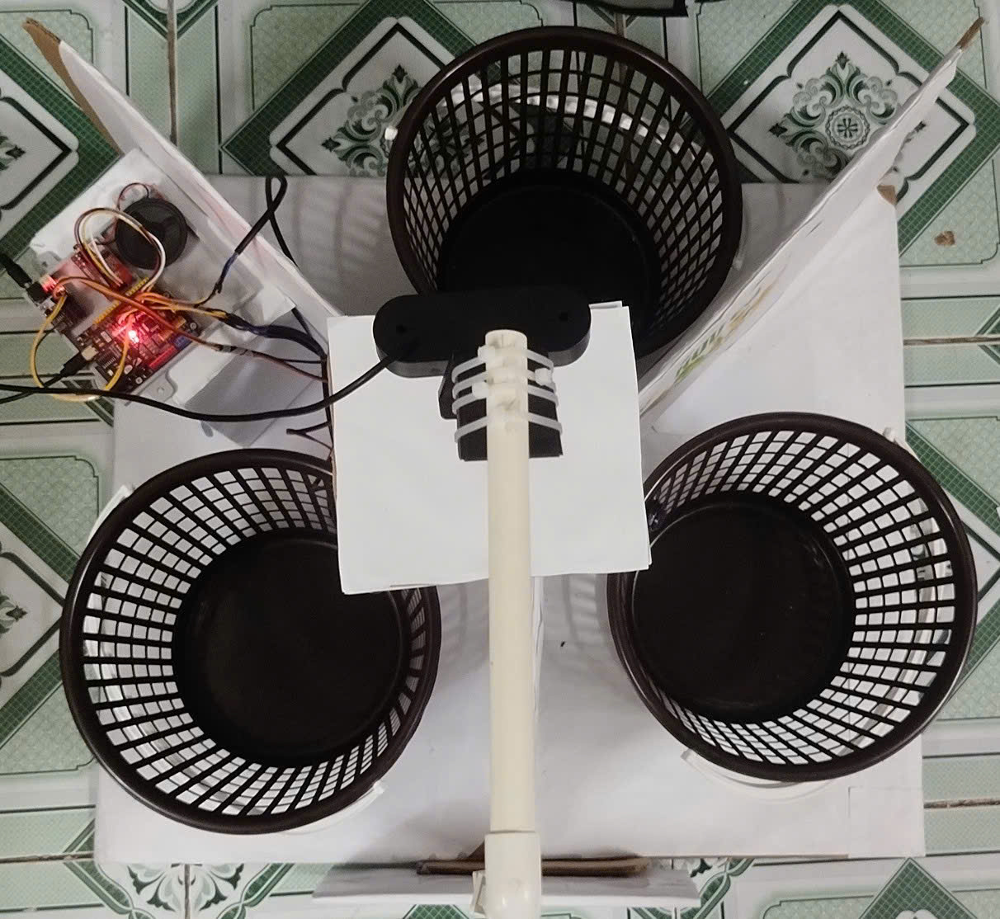
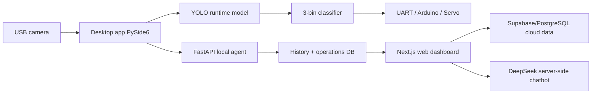

# Trash Sorter Pro — Project Showcase

  

Tài liệu này dùng để giới thiệu dự án trên GitHub/portfolio và làm checklist
nhanh khi bàn giao cho người vận hành. Ảnh minh hoạ trong file được chụp trực
tiếp từ desktop app và web production.

## GitHub About nên điền

Ảnh người dùng gửi cho thấy phần **About** của repository còn trống. Nội dung đề
xuất:

- **Description:** AI-powered waste sorting system with YOLO, PySide6 desktop control, Next.js dashboard, UART/Arduino hardware bridge, Supabase and EcoPet AI.
- **Website:** `https://trash-sorter-v2.vercel.app`
- **Topics:** `yolo`, `computer-vision`, `waste-sorting`, `pyside6`, `nextjs`, `fastapi`, `arduino`, `uart`, `iot`, `supabase`, `deepseek`, `vercel`
- **README:** giữ ảnh desktop/web ở đầu README để GitHub About trỏ vào trang giới thiệu có hình ngay.
- **Releases:** khi chốt bản demo, tạo release theo mẫu `vYYYY.MM.DD-demo` và gắn các ghi chú: desktop build, web URL, model runtime, phần cứng đã test.

## Ảnh minh hoạ

### Desktop app

| Live Detection | Mapping 80 lớp -> 3 thùng |
| --- | --- |
|  |  |

| Huấn luyện thủ công | Cài đặt camera/ROI/UART |
| --- | --- |
|  |  |

Desktop app là bề mặt vận hành trực tiếp tại máy phân loại. Màn hình Live cho
Admin bật/tắt camera, chọn chế độ chỉ nhận diện hoặc tự động phân loại, xem
camera stream, kết quả hiện tại, trạng thái UART/model/FPS và cấu hình loa.

### Video nguyên mẫu phần cứng

| Video | Nội dung | Thời lượng |
| --- | --- | ---: |
| [Demo vận hành tổng thể](assets/demo/product-demo-overview.mp4) | Đặt vật lên khay, cơ cấu quay và ba thùng phân loại | 17 giây |
| [Toàn cảnh mô hình](assets/demo/hardware-front-view.mp4) | Camera, khay, servo, mạch điều khiển và bố trí ba thùng | 4 giây |
| [Thùng Hữu cơ](assets/demo/organic-bin-demo.mp4) | Góc cận cảnh thùng và cảm biến mức đầy | 2 giây |
| [Thùng Vô cơ](assets/demo/inorganic-bin-demo.mp4) | Góc cận cảnh thùng, cảm biến và mạch điều khiển | 1 giây |

Các tệp media là bản quay trực tiếp từ nguyên mẫu sản phẩm và được lưu cùng tài liệu để
README/portfolio không phụ thuộc liên kết ngoài.

### Web dashboard

| User Dashboard | EcoPet AI |
| --- | --- |
|  |  |

| Bản đồ thùng | Phân tích |
| --- | --- |
|  |  |

| Cảnh báo |
| --- |
|  |

Web dashboard cho User tổng hợp dữ liệu đã phân quyền: tổng lượt phân loại, tỷ
lệ tái chế, độ tin cậy AI, Eco Score, biểu đồ theo ngày, trạng thái thùng, cảnh
báo và lịch sử gần đây.

### EcoPet AI

EcoPet AI trả lời bằng tiếng Việt có dấu, dùng context đã scope theo quyền tài
khoản và không gửi secret, token, raw log, ảnh camera hoặc dữ liệu của tài khoản
khác lên AI provider.

## Kiến trúc tổng quan

## Thành phần chính

| Thành phần | Công nghệ | Vai trò |
| --- | --- | --- |
| Desktop app | Python, PySide6 | Điều khiển camera, live detection, mapping, data review, training, settings |
| AI runtime | YOLO + 3-bin classifier | Nhận diện class chi tiết và gom về Hữu cơ/Vô cơ/Tái chế |
| Hardware | USB camera, UART, Arduino/ESP32, servo, loa | Phân loại vật lý và phản hồi âm thanh |
| Local agent | FastAPI | API cho web local, auth, history, dataset, model, hardware bridge |
| Web dashboard | Next.js, TypeScript | UI Admin/User, báo cáo, bản đồ, cảnh báo, EcoPet |
| Cloud data | Supabase/PostgreSQL | Lưu auth/session, history scoped theo user, bin map, alerts, schedules |
| AI assistant | DeepSeek server-side | Chatbot/Admin advisor với prompt role-safe và fallback tiếng Việt có dấu |

## Luồng vận hành thực tế

1. Camera USB đọc khay rác.
2. YOLO nhận diện vật thể chi tiết.
3. Runtime lọc bbox nhiễu, xử lý confidence và gom class về 3 nhóm.
4. Desktop app hiển thị kết quả, ghi lịch sử và phát loa.
5. Khi bật tự động, app gửi lệnh UART tới Arduino/ESP32 để điều khiển servo/thùng.
6. Web dashboard đọc dữ liệu đã đồng bộ để User/Admin theo dõi.
7. EcoPet/Admin chat dùng context đã sanitize để trả lời câu hỏi vận hành.

## Phân quyền

| Role | Được phép | Bị chặn |
| --- | --- | --- |
| User | Dashboard cá nhân, Eco Score, lịch sử của mình, bản đồ thùng được gán, cảnh báo, lịch thu gom, báo lỗi thiết bị, EcoPet | Camera, training, dataset, model, logs, settings, tài khoản khác |
| Admin | Toàn bộ dashboard vận hành, camera, training, map, alerts, devices, roles, reports, AI knowledge | Không nhận secret/token/raw log trong chatbot |

## Điểm nổi bật để đưa vào README/portfolio

- End-to-end từ camera thật đến dashboard cloud, không chỉ là notebook model.
- Desktop app vận hành được phần cứng: camera USB, UART, servo, loa, trạng thái model/FPS.
- Web dashboard có phân quyền Admin/User và dữ liệu User được scope theo username.
- EcoPet AI đã chạy production qua Vercel server-side, có quota và fallback tiếng Việt có dấu.
- Supabase/PostgreSQL hỗ trợ cloud auth, operations map, alerts và lịch thu gom.
- Tài liệu kiểm thử có unit/integration/e2e, Playwright và checklist phần cứng.

## Link vận hành nhanh

- Web production: [trash-sorter-v2.vercel.app](https://trash-sorter-v2.vercel.app)
- Hướng dẫn web: [huong-dan-chay-web-app.md](huong-dan-chay-web-app.md)
- Cloud readiness: [supabase-full-cloud-readiness.md](supabase-full-cloud-readiness.md)
- Hardware checklist: [hardware_integration_checklist.md](hardware_integration_checklist.md)
- Operations map: [operations-map-local-first.md](operations-map-local-first.md)

## Checklist trước khi tạo GitHub Release

- `npm run test:unit`
- `npm run build`
- Playwright smoke cho User/Admin critical paths.
- Desktop app mở được Live, Settings, Mapping, History.
- Camera USB ngoài được nhận; laptop webcam không được auto fallback.
- UART chỉ bật khi cổng USB/Arduino thật sẵn sàng.
- DeepSeek key nằm ở server-side env, không dùng `NEXT_PUBLIC_*`.
- Ảnh README đã cập nhật sau khi UI thay đổi lớn.
