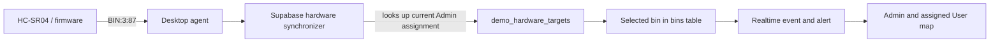

# Trash Sorter Pro v2.1.0 — Cloud Map & Hardware Bridge

**Released:** 2026-06-20  
**Production:** <https://trash-sorter-v2.vercel.app>  
**Scope:** desktop recognition, cloud dashboard, realtime bin map, EcoPet AI,
and the secure Admin hardware bridge.

## What people can understand at a glance

Trash Sorter Pro has two connected applications:

| Application | Who uses it | Main job |
| --- | --- | --- |
| Desktop app | Operator/Admin at the machine | Runs the USB camera, YOLO detection, UART/Arduino commands, sound, and reads physical fullness sensors. |
| Web dashboard | Admin and User | Shows cloud data: bins, alerts, collection schedules, Eco Score, reports, and EcoPet AI. |

The web dashboard does **not** drive a User’s camera or machine. Admin camera
and training actions travel through the protected hardware bridge; ordinary map
and chat data use the cloud database directly.

## Map sensor button: exact meaning

The map control is intentionally **not a reset button**.

`Gán cảm biến` means: *choose which cloud bin receives a physical fullness
reading from the hardware machine.* For example, choosing the recyclable bin
with index `3` maps the next `BIN:3:87` UART reading to that selected bin. The
web map then updates to `87%`, creates/updates the appropriate alert, and User
views receive the realtime update.



### What Admin sees

1. Open **Bản đồ thùng**.
2. Open a station marker.
3. Read the green explanation block: it says the action assigns a physical
   sensor and does not reset the current fill percentage.
4. Press **Gán cảm biến** on the intended O/R/I bin.
5. The action changes to **Đang nhận dữ liệu cảm biến** and a success message
   confirms the `BIN:<index>` mapping, station, and non-reset behavior.
6. Refreshing the page keeps the selected state because the assignment is read
   back from Supabase.

Only one physical demo target is active at once. Selecting a different bin
changes the destination for future hardware readings; it does not modify old
history, erase alerts, or set a percentage to zero.

### What User sees

Users can see the assigned station, current fullness, and the label
**Cảm biến phần cứng đang đồng bộ**. They cannot change the mapping. This avoids
one User accidentally rerouting the shared physical sensor away from another
station.

### What happens when the bin is full

- Under `80%`: normal state.
- From `80%` to `94%`: warning / near full.
- From `95%`: full state and an alert is created or refreshed.
- Map refresh: authenticated User map checks realtime events every 1.2 seconds;
  the regular refresh remains as a fallback.

## Security and role boundaries

| Action | Admin | User |
| --- | --- | --- |
| Assign the shared physical sensor target | Yes | No |
| View assigned bins and realtime fullness | Yes | Yes, only assigned stations |
| Use camera/live/training through bridge | Yes | No |
| Read another account’s map/history | No special restriction for operations | No |

The assignment is validated server-side against an active station and active
bin. A User cannot forge an owner name. The bridge exports neither images,
tokens, raw logs, passwords, nor arbitrary local endpoints.

## Operating the bridge

On the hardware computer, run:

```powershell
powershell -ExecutionPolicy Bypass -File scripts/start_public_hardware_bridge.ps1
```

The script starts or reuses the local agent, Supabase state synchronizer, and
Cloudflare tunnel. Copy its HTTPS URL into Vercel Production as
`TRASH_SORTER_HARDWARE_BRIDGE_URL`; the bridge secret must match
`TRASH_SORTER_HARDWARE_BRIDGE_SECRET` on both sides.

For a real deployment, use a named Cloudflare Tunnel or service manager. A
Quick Tunnel URL changes whenever `cloudflared` restarts, so Vercel must be
updated and redeployed after a URL change.

## EcoPet AI in this release

- Runs server-side with DeepSeek; no API key is exposed to the browser.
- Answers in Vietnamese with diacritics, short practical guidance, and
  role-scoped context.
- User quota is 36 requests per month.
- If AI is unavailable or returns poor Vietnamese text, EcoPet uses a safe
  Vietnamese fallback and does not invent machine status.

## Verification completed

- Web build completed successfully.
- Unit suite: **89/89 passed**.
- Production alias and external bridge health endpoint were verified before
  this release candidate.

## Upgrade checklist

1. Apply the Supabase migrations, including
   `202606180004_demo_hardware_targets.sql`.
2. Set `NEXT_PUBLIC_DEMO_HARDWARE_TARGET=1` on Vercel only when the demo sensor
   control is intentionally enabled.
3. Set `TRASH_SORTER_DEMO_HARDWARE_TARGET=1` only on the hardware bridge.
4. Confirm a bridge health response before enabling Admin camera controls.
5. Sign in as Admin, assign one sensor target, then send a safe test reading
   such as `BIN:3:65` from the hardware firmware.
6. Sign in as the assigned User and confirm the map updates without exposing
   Admin controls.
