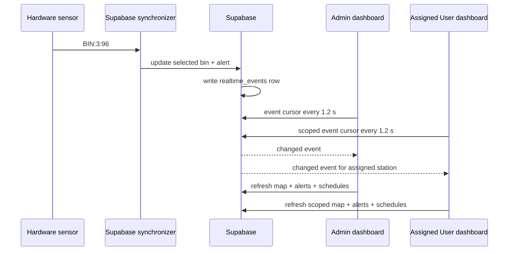

# Trash Sorter Pro v2.1.1 — Admin & User Realtime

**Released:** 2026-06-20  
**Production:** <https://trash-sorter-v2.vercel.app>

## Purpose

This patch makes the realtime behavior identical for both dashboard roles.
When the hardware bridge records a fullness change such as `BIN:3:96`, the
relevant Admin and User screens refresh automatically. Neither person needs to
close the popup or press the map refresh button.

## Realtime behavior

- **Admin:** sees every active station, its bin fullness, and alerts.
- **User:** sees only stations assigned to that account.
- **Cursor interval:** 1.2 seconds while a supported operations screen is
  visible and the tab is not hidden.
- **Fallback:** a six-second background refresh protects against a temporary
  event-cursor failure.
- **No data leakage:** Admin endpoint requires Admin session; User endpoint
  applies station-owner filtering server-side.

## Screens covered

| Role | Screens refreshed automatically |
| --- | --- |
| Admin | Bản đồ thùng, Cảnh báo, Thiết bị, Báo cáo |
| User | Tổng quan, Bản đồ, Cảnh báo, Lịch, Thu gom, Báo lỗi thiết bị |

## Verification

1. Open Admin **Bản đồ thùng** and an assigned User **Bản đồ** in separate
   browser sessions.
2. Admin assigns the physical sensor to a bin.
3. Send a firmware reading, for example `BIN:3:65`, then `BIN:3:96`.
4. Both maps should update within roughly 1.2 seconds. At 96%, both should show
   the full state and the relevant alert.
5. Confirm the User cannot access the Admin event endpoint or unassigned bins.

## Validation completed

- Unit tests cover the Admin event cursor’s unscoped query and existing User
  owner-scoped query.
- Production build passes before deployment.
