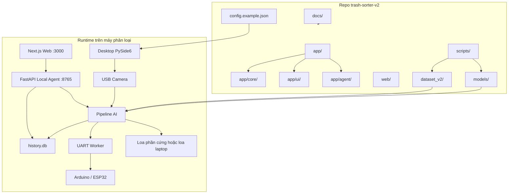
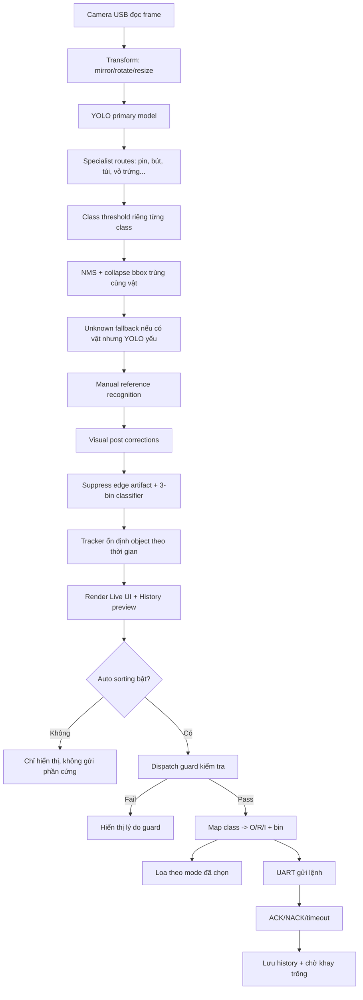
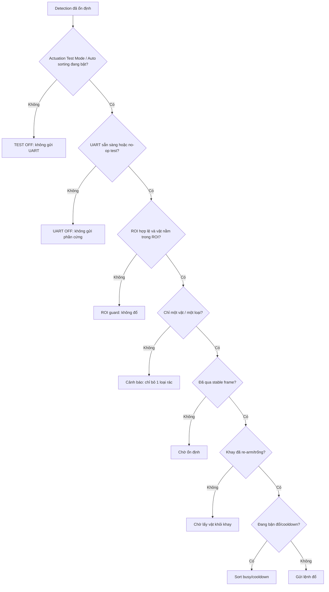
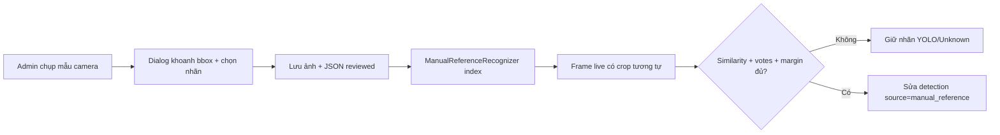
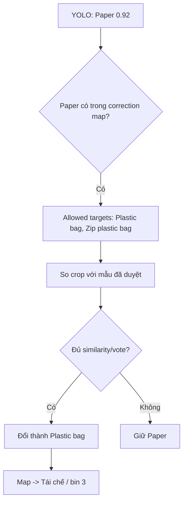
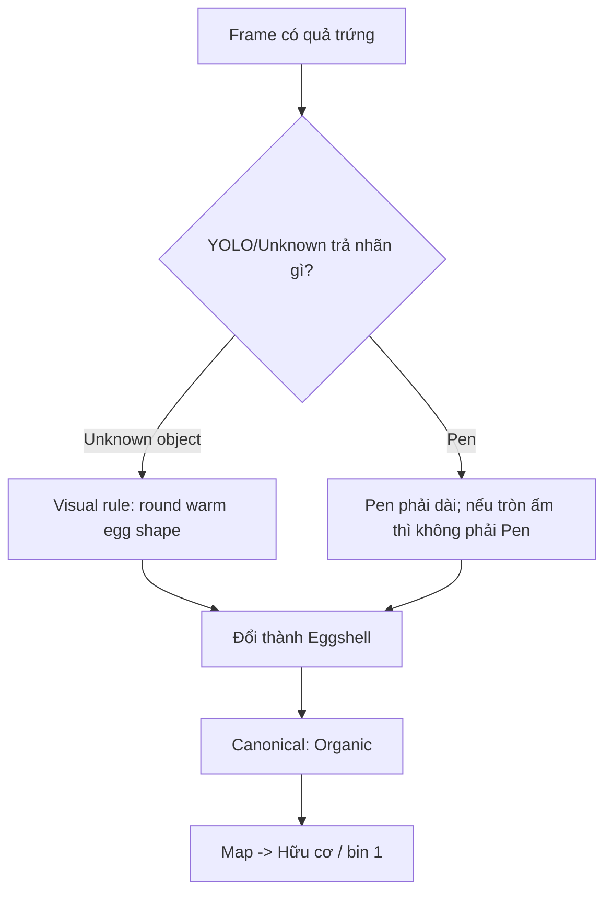
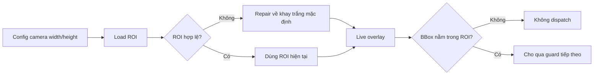
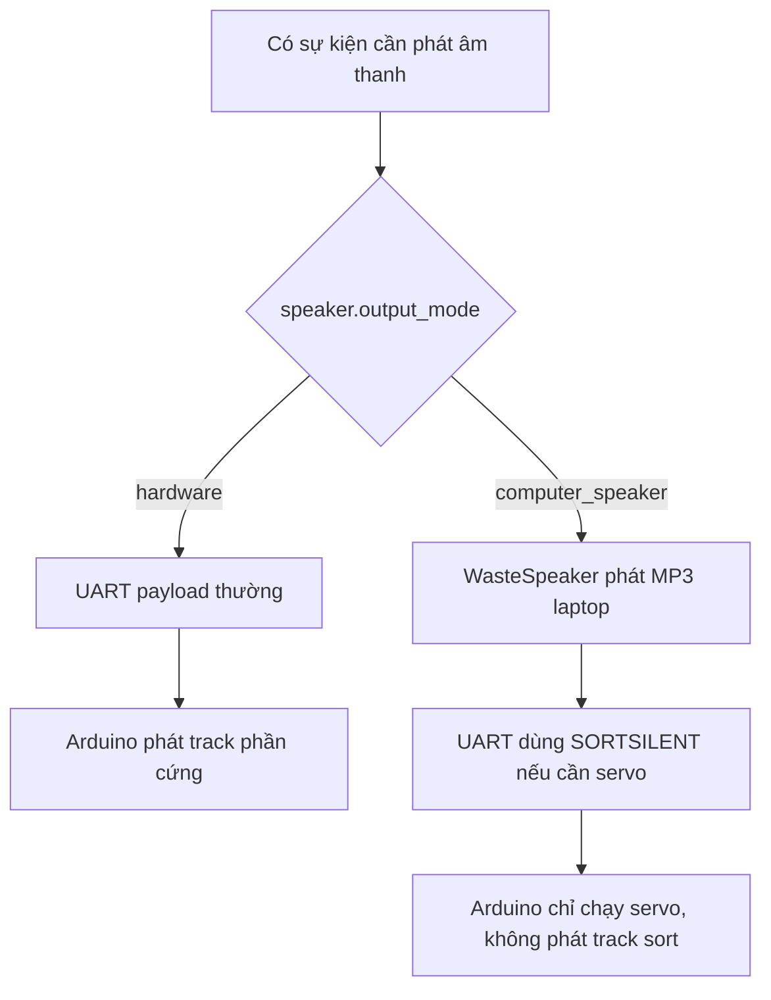
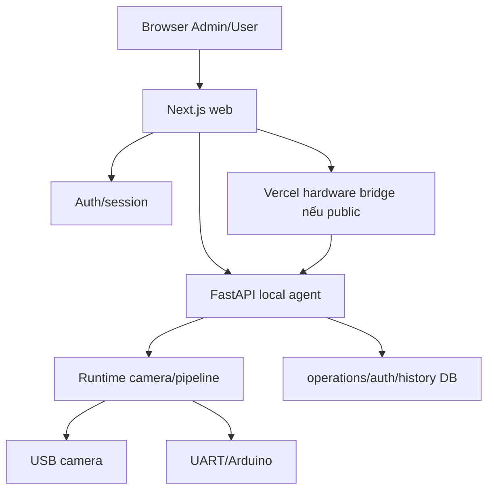
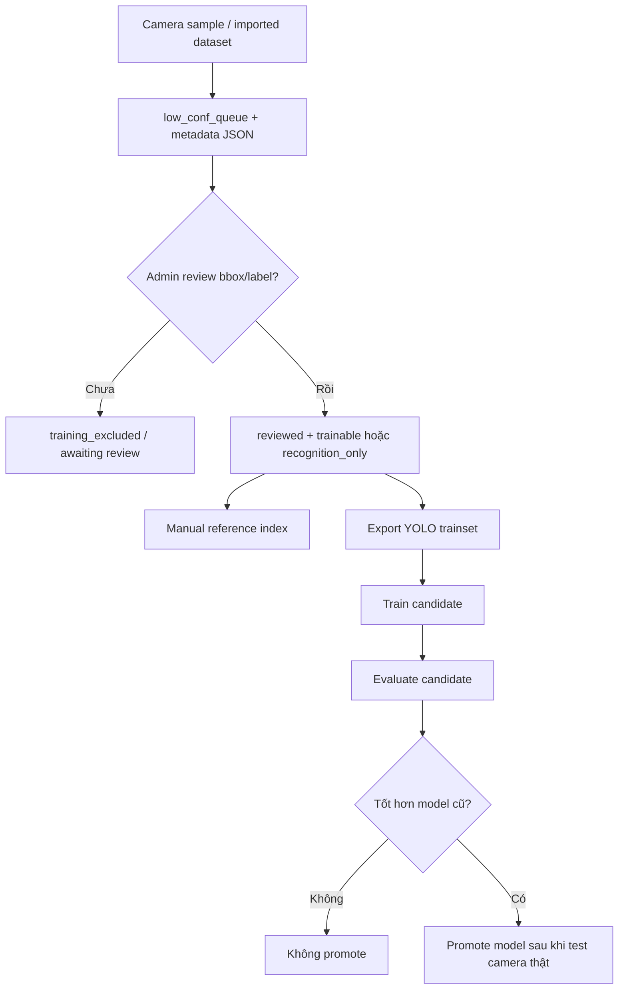

# Trash Sorter Pro - Tài liệu kỹ thuật vận hành

Tài liệu này mô tả chi tiết kiến trúc, luồng xử lý AI, camera USB, UART/Arduino, loa, web dashboard, dữ liệu huấn luyện và các lớp bảo vệ an toàn của Trash Sorter Pro. Mục tiêu là để người mới mở repo có thể hiểu hệ thống đang làm gì, dữ liệu đi qua đâu, vì sao app quyết định đổ hoặc không đổ, và cần kiểm tra file nào khi có lỗi.

## 1. Tóm tắt hệ thống

Trash Sorter Pro là hệ thống phân loại rác theo mô hình local-first:

- Desktop app PySide6 là màn hình vận hành chính tại máy phân loại.
- Core Python xử lý camera, YOLO, sửa nhãn, guard, lịch sử, UART và loa.
- Local FastAPI agent chia sẻ trạng thái phần cứng/camera cho web dashboard.
- Web dashboard Next.js phục vụ Admin/User, theo dõi thiết bị, dữ liệu, training và báo cáo.
- Arduino/ESP32 nhận lệnh UART để điều khiển servo/thùng và loa phần cứng.
- Dataset local giữ mẫu camera thật để review, huấn luyện nhanh và sửa nhãn bằng manual reference.

Triết lý vận hành hiện tại: ưu tiên máy đổ rác được ổn định với camera mờ, nhưng không được gửi lệnh khi hệ thống thấy nhiều vật, vật ngoài ROI, khay chưa trống, UART chưa sẵn sàng hoặc nhãn đang ở trạng thái chưa đủ tin cậy.

## 2. Sơ đồ tổng thể repo và runtime



## 3. Các thành phần chính

| Thành phần | File/thư mục chính | Vai trò |
| --- | --- | --- |
| Desktop entrypoint | `app/__main__.py` | Nạp config, mở giao diện PySide6, nối signal UI với controller. |
| UI controller | `app/ui/controller.py` | Quản lý camera, UART, pipeline, test phần cứng, loa, training, web launcher. |
| Core pipeline | `app/core/pipeline.py` | Xử lý mỗi frame: inference, filter, manual reference, visual correction, guard, dispatch. |
| Config schema/repair | `app/core/config.py` | Định nghĩa cấu hình, tự sửa config cũ, ngưỡng model, ROI, speaker, guard. |
| Inference | `app/core/inference.py` | Load YOLO và trả về detection thô. |
| Manual reference | `app/core/manual_reference_recognition.py` | So khớp crop camera với mẫu đã duyệt để sửa nhãn model. |
| Visual correction | `app/core/visual_post_corrections.py` | Sửa nhãn bằng heuristic ảnh khi camera mờ hoặc YOLO nhầm. |
| Dispatch guard | `app/core/dispatch_guard.py` | Chặn đổ khi chưa ổn định, nhiều vật, khay chưa trống, cooldown, ngoài ROI. |
| UART | `app/core/uart.py`, `app/core/uart_protocol.py` | Gửi lệnh `huuco`, `voco`, `taiche` hoặc `SORT*` xuống phần cứng. |
| Speaker | `app/core/speaker.py` | Phát MP3 bằng loa laptop khi chọn computer speaker; phần cứng tự phát khi chọn hardware. |
| Local agent | `app/agent/api.py`, `app/agent/runtime.py` | API local cho web: camera, status, dataset, training, mapping, reports. |
| Web dashboard | `web/` | Next.js UI cho Admin/User, gọi local agent hoặc hardware bridge. |
| Build EXE | `scripts/build_exe.py` | Đóng gói app desktop thành `dist/TrashSorterPro/`. |

## 4. Luồng nhận diện một vật trên camera



Điểm quan trọng: app không lấy nhãn YOLO thô để đổ ngay. Một detection phải đi qua nhiều lớp sửa nhãn và guard. Vì vậy cùng một vật có thể hiển thị khác nhau giữa frame đầu và frame sau nếu manual reference hoặc visual correction đủ điều kiện sửa nhãn.

## 5. Luồng quyết định có được đổ hay không



Các guard này giải thích phần lớn câu hỏi kiểu “nhận diện đúng mà không đổ”. Khi UI ghi `TEST OFF`, `UART OFF`, `outside ROI`, `waiting empty tray`, `low confidence`, `many objects`, hoặc `ACK pending`, tức là AI đã thấy vật nhưng pipeline cố tình không gửi lệnh để tránh đổ sai.

## 6. Mapping 3 thùng

Runtime vẫn nhận diện nhiều class chi tiết, nhưng phần cứng chỉ cần 3 nhóm vận hành:

| Nhóm | Command logic | Payload UART legacy | Bin | Ý nghĩa |
| --- | --- | --- | ---: | --- |
| Hữu cơ | `O` | `huuco` | 1 | Lá cây, thức ăn, hữu cơ, vỏ trứng. |
| Vô cơ | `R` | `voco` | 2 | Bút, pin, đồ nguy hại, đồ khó tái chế, vật cần an toàn. |
| Tái chế | `I` | `taiche` | 3 | Chai/lọ nhựa, bì ni lông, giấy, kim loại tái chế. |

Mapping class nằm trong `config.example.json` và runtime config `%APPDATA%/TrashSorter/config.json`. Khi config cũ thiếu mapping/ngưỡng quan trọng, `app/core/config.py` tự repair lúc app khởi động.

## 7. AI model, specialist và ngưỡng class

Model chính hiện được cấu hình trong `model.path`. Repo có logic repair để ưu tiên candidate camera thật:

- `models/real-camera-balanced-20260619-candidate.pt` nếu tồn tại.
- Specialist model ở `models/new-class-specialist.pt`.
- Ngưỡng class riêng giúp camera mờ vẫn giữ detection yếu nhưng có ích.

Ví dụ ngưỡng đang được bảo vệ trong config repair:

| Class | Ngưỡng | Lý do |
| --- | ---: | --- |
| `Organic` | `0.25` | Hữu cơ camera thật thường mềm/mờ. |
| `Plastic bag` | `0.16` | Bì ni lông trong suốt/nhăn rất khó nhận. |
| `Glass bottle` | `0.45` | Giảm nhầm chai/lọ thủy tinh. |
| `Pen` | `0.35` | Bút nhỏ, dài, dễ mất nét. |

Không nên chỉ hạ ngưỡng toàn hệ thống quá thấp. Cách ổn hơn là hạ có kiểm soát theo class, rồi dùng manual reference và guard để ngăn đổ sai.

## 8. Manual reference recognition

Manual reference là lớp “học nhanh không cần train full model”. Khi Admin chụp mẫu camera và duyệt nhãn, ảnh/crop đó được lưu trong `dataset_v2/low_conf_queue`. Runtime đọc các JSON đã duyệt, tạo embedding ảnh, rồi dùng voting để sửa nhãn.



Các thông số quan trọng:

| Config | Giá trị hiện tại | Ý nghĩa |
| --- | ---: | --- |
| `min_similarity` | `0.88` | Ngưỡng chung cho correction. |
| `unknown_min_similarity` | `0.92` | Unknown phải khớp mạnh hơn để tránh đoán bừa. |
| `organic_unknown_min_similarity` | `0.65` | Riêng hữu cơ có thể mềm hơn nhưng cần consensus. |
| `top_k` | `7` | Lấy 7 mẫu gần nhất để vote. |
| `min_votes` | `4` | Correction thông thường cần ít nhất 4 vote. |
| `max_correction_confidence` | `0.95` | Cho phép sửa cả nhãn YOLO tự tin nhưng sai, ví dụ `Paper -> Plastic bag`. |

## 9. Cơ chế sửa bì ni lông camera mờ

Vấn đề thực tế: bì ni lông đen/xanh nhăn, mờ hoặc gần camera có thể bị YOLO gán thành `Paper` với confidence cao. Hạ ngưỡng `Plastic bag` không đủ vì model không chọn class đó.

Logic đã cấu hình:

- `Paper` được phép sửa sang `Plastic bag` hoặc `Zip plastic bag`.
- `max_correction_confidence` tăng lên `0.95` để sửa được cả trường hợp `Paper 0.92`.
- Các mẫu bì ni lông đã duyệt được đưa vào manual reference.
- Khi crop mới giống mẫu bì ni lông đã duyệt, detection đổi sang `Plastic bag` với source `manual_reference`.
- Sau khi đổi sang `Plastic bag`, mapping đưa về nhóm tái chế/bin 3.



## 10. Cơ chế sửa quả trứng bị nhầm bút bi

Vấn đề thực tế: camera mờ làm vật tròn/nâu như quả trứng có lúc rơi vào `Unknown object`, có lúc bị nhảy nhầm `Pen`. Vì `Pen` thuộc vô cơ, nếu không sửa sẽ đổ sai.

Logic hiện tại:

- Nếu detection là `Unknown object` và crop có hình tròn/oval, màu ấm, không quá sáng, không quá dài, app sửa thành `Eggshell`.
- Nếu detection là `Pen` nhưng hình học lại giống trứng/vỏ trứng, app sửa thành `Eggshell`.
- `Pen` cũng được phép manual-reference correction sang `Organic` khi crop khớp mẫu hữu cơ đã duyệt.
- `Eggshell` được route về hữu cơ/bin 1 qua specialist route và waste category.



## 11. Visual post corrections

File `app/core/visual_post_corrections.py` chứa các rule nhỏ để xử lý lỗi camera thật:

- Lá cây/hữu cơ bị model gọi nhầm giấy/nhựa.
- Trứng/vỏ trứng bị unknown hoặc bút.
- Đồ tròn trắng trơn bị model tưởng vỏ trứng thì đưa về unknown để an toàn.
- Muỗng kim loại bị gọi nhầm giấy.
- Chai nhựa trong bị gọi nhầm lon/lọ.
- Vật sát mép camera bị suppress để tránh nhận cạnh khay/lồng.

Nguyên tắc: heuristic chỉ sửa các lỗi có dấu hiệu hình học/màu sắc rõ, không thay thế training. Với class dễ nguy hiểm như pin, app cần nhãn hoặc xác nhận rõ trước khi gửi lệnh.

## 12. ROI và vì sao ROI có thể nhìn “lạ”

ROI là vùng khay hợp lệ để đổ. App repair ROI nếu config cũ bị tắt, sai kích thước, vượt khung camera hoặc không còn phù hợp độ phân giải. Nếu camera đổi resolution, ROI được scale lại theo `default_tray_roi_for_camera`.

Luồng ROI:



Nếu ROI nhìn quá nhỏ hoặc lệch, cần kiểm tra:

1. Camera đang chạy đúng USB camera chưa.
2. `camera.width`, `camera.height` trong config có khớp frame thật không.
3. Có rotation/mirror đang bật không.
4. ROI trong `%APPDATA%/TrashSorter/config.json` có bị lưu từ cấu hình cũ không.

## 13. Nhiều vật và cảnh báo “chỉ bỏ 1 loại rác”

Hệ thống được thiết kế mỗi lượt chỉ xử lý một vật hợp lệ. Khi foreground split hoặc detection thấy nhiều vùng/nhãn, app cảnh báo thay vì đổ.

Điều này tránh trường hợp:

- Bút và lá cây nằm chung một khay.
- Một vật lớn bị split thành nhiều nhãn không chắc chắn.
- Người đặt thêm vật mới khi vật cũ chưa lấy ra.
- Camera rung làm scale/servo tạo detection phụ.

Nếu thực tế chỉ có một vật nhưng vẫn cảnh báo nhiều vật, thường do:

- Vật chạm cạnh khay/lồng, tạo foreground phụ.
- Bóng đổ mạnh.
- ROI lấy cả cạnh khay.
- Vật quá gần camera làm bbox tràn khung.

## 14. Loa phần cứng và loa laptop

Mode loa nằm ở `speaker.output_mode`:

- `hardware`: firmware/OPEN-SMART phát track phần cứng.
- `computer_speaker`: app phát MP3 trên laptop và gửi lệnh silent xuống firmware để servo vẫn chạy nhưng phần cứng không đọc nhầm.

Luồng phân nhánh:



Khi test lỗi loa:

1. Nhìn UI đang chọn nút nào.
2. Kiểm tra config runtime `%APPDATA%/TrashSorter/config.json`.
3. Xem log UART có gửi `SORTSILENT` hay payload thường.
4. Với cảm biến đầy, xác định event đến từ firmware hay app để biết ai phát âm thanh.

## 15. UART và ACK

Giao thức legacy đang dùng:

| Nhóm | App command | Payload xuống Arduino | ACK mong đợi |
| --- | --- | --- | --- |
| Hữu cơ | `O` | `huuco` | `ACK:O` hoặc ACK payload tương ứng |
| Vô cơ | `R` | `voco` | `ACK:R` |
| Tái chế | `I` | `taiche` | `ACK:I` |

Các trạng thái hay gặp:

- `ACK pending`: đã gửi, đang chờ board trả lời.
- `ACK TEST OFF`: đang ở chế độ không gửi phần cứng.
- `UART OFF`: không có cổng USB/Arduino hợp lệ.
- `NACK`: board từ chối hoặc lỗi firmware.
- `timeout`: app gửi nhưng không nhận ACK trong thời gian cho phép.

Không nên đổ tiếp khi ACK còn pending vì servo chưa chắc đã về HOME.

## 16. Admin/User web và hardware bridge



Admin có quyền camera/live/training/settings/logs/hardware test. User chỉ xem dashboard, lịch sử của mình, bản đồ thùng, cảnh báo, lịch thu gom và báo cáo. Public hardware bridge chỉ expose allowlist API cần thiết, có secret riêng để tránh người dùng public điều khiển phần cứng.

## 17. Training và vòng đời dữ liệu



Các command quan trọng:

```powershell
python -m uv run python scripts/audit_dataset.py --strict-trainset
python -m uv run python scripts/export_yolo_trainset.py
python -m uv run python scripts/train_yolo.py --device 0 --epochs 100 --imgsz 640 --batch 16 --workers 0 --patience 20 --name trash-sorter-v3 --exist-ok
python -m uv run python scripts/evaluate_yolo.py --model runs\train\trash-sorter-v3\weights\best.pt --split test
```

Nguyên tắc dữ liệu:

- Screenshot chat không dùng trực tiếp làm training data nếu không có crop/camera metadata phù hợp.
- Mẫu camera đã khoanh bbox và duyệt nhãn có thể dùng làm manual reference.
- `recognition_only` dùng để sửa nhãn runtime, không nhất thiết đưa vào train.
- Holdout không được đưa vào manual reference index/training.
- Candidate model không thay `models/best.pt` nếu chưa vượt benchmark và test camera thật.

## 18. Build, chạy và kiểm thử

Chạy desktop từ source:

```powershell
cd "D:\PHAN LOAI RAC\trash-sorter-v2"
python -m uv sync --frozen
python -m uv run python -m app
```

Build EXE:

```powershell
python -m uv run python scripts/build_exe.py
```

Chạy web + agent:

```powershell
powershell -ExecutionPolicy Bypass -File scripts/start_local.ps1
```

Test nên chạy trước khi commit:

```powershell
python -m uv run ruff check app scripts tests
python -m uv run pytest -q
cd web
npm run build
```

Khi sửa riêng pipeline nhận diện, có thể chạy targeted test để nhanh hơn:

```powershell
python -m uv run pytest tests/unit/test_visual_post_corrections.py tests/unit/test_config.py tests/integration/test_pipeline_e2e.py -q
```

## 19. Checklist debug theo triệu chứng

| Triệu chứng | Nơi kiểm tra trước | Nguyên nhân hay gặp |
| --- | --- | --- |
| Nhận diện đúng nhưng không đổ | Live guard text, `dispatch_guard`, UART status | TEST OFF, UART OFF, ngoài ROI, khay chưa trống, ACK pending, nhiều vật. |
| Một vật bị nhiều nhãn | `suppress_overlapping_detections`, foreground split, ROI | Vật quá gần camera, bóng, cạnh khay, bbox chồng. |
| Bì ni lông thành Paper/Unknown | manual reference, `Paper -> Plastic bag`, class threshold | Model chưa học đủ túi nhăn/mờ; cần mẫu đã duyệt. |
| Trứng thành Bút bi | `visual_post_corrections.py` | Camera mờ, vật tròn bị specialist nhầm; rule sửa về Eggshell. |
| FPS thấp | model input size, camera backend, process train đang chạy | Train/EXE/app chạy song song, GPU bận, camera reconnect. |
| Admin web báo agent offline | `scripts/start_local.ps1`, port 8765, bridge secret | Local agent chưa chạy hoặc secret/URL public bridge sai. |
| USB camera không thấy trên Admin | Local agent runtime camera, quyền Admin, hardware bridge | Web public không có tunnel, camera bị desktop giữ lock, agent chưa sẵn sàng. |
| Loa chọn hardware nhưng laptop phát | `speaker.output_mode`, UART payload, sensor event source | Config chưa repair, event phát từ app thay vì firmware, silent payload chưa dùng đúng. |
| Train nhanh đứng | `runs/train/*`, process list, training logs | Đang có train process cũ, thiếu mẫu train/holdout, GPU bận. |

## 20. Quy tắc khi sửa code nhận diện

1. Không sửa bằng cách hạ toàn bộ `model.conf_threshold` quá sâu nếu chỉ một class lỗi.
2. Ưu tiên thêm route manual reference có giới hạn nguồn/đích, ví dụ `Paper -> Plastic bag`.
3. Với lỗi hình học rõ, thêm visual correction nhỏ và có test.
4. Không để Unknown tự động đổ nếu chưa có fallback/mapping an toàn.
5. Khi sửa guard, phải nghĩ tới servo thật: đổ nhanh quá sẽ sai cơ khí.
6. Mọi thay đổi runtime config nên có repair trong `app/core/config.py`.
7. Sau khi build EXE, mở lại app để config repair chạy trên `%APPDATA%/TrashSorter/config.json`.

## 21. Các file nên đọc khi onboarding

1. `README.md` - tổng quan, cách chạy, demo, tài khoản, UART.
2. `docs/technical-architecture-vi.md` - tài liệu này.
3. `config.example.json` - cấu hình gốc và các ngưỡng.
4. `app/core/pipeline.py` - đường đi chính của detection.
5. `app/core/config.py` - config schema và repair.
6. `app/core/visual_post_corrections.py` - các rule sửa nhãn camera thật.
7. `app/core/manual_reference_recognition.py` - index mẫu đã duyệt.
8. `app/ui/controller.py` - nối UI với pipeline/UART/loa.
9. `app/agent/api.py` - API local/web/hardware bridge.
10. `docs/hardware_integration_checklist.md` - phần cứng thật.

## 22. Trạng thái kỹ thuật hiện tại cần nhớ

- Runtime đang ưu tiên camera USB ngoài, không fallback webcam laptop.
- Auto sorting chỉ nên bật khi ROI, UART, camera, model và khay đều sẵn sàng.
- Bì ni lông mờ/nhăn được hỗ trợ bằng manual reference, không chỉ dựa vào YOLO.
- Quả trứng/vỏ trứng được sửa khỏi `Unknown object` hoặc `Pen` bằng visual correction.
- Bút/pin/vật nguy hại mặc định đi vô cơ để an toàn.
- Public web chỉ điều khiển phần cứng qua bridge có secret và allowlist.
- Dataset local, model candidate và DB runtime không nên commit nếu là dữ liệu máy thật.
